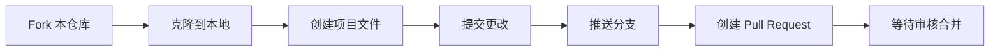

# 🚀 NoldusCN AI Vibe Coding 2026

**第一届 AI 辅助编程创新大赛**

*让 AI 成为你的编程伙伴，让创意照进现实*

---

## 📖 目录

- [大赛初衷](#-大赛初衷)
- [参赛方式](#-参赛方式)
- [比赛规则](#-比赛规则)
- [项目展示](#-项目展示)
- [常见问题](#-常见问题)
- [学习资源](#-学习资源)

---

## 🎯 大赛初衷

在 AI 飞速发展的今天，编程的方式正在发生深刻变革。**Vibe Coding** 不仅仅是一种编程方式，更是一种思维模式——让 AI 成为你的编程伙伴，在"人机协作"中释放创造力。

本次大赛旨在：

- **激发创新**：鼓励大家用 AI 工具解决实际工作中的痛点
- **交流学习**：将分散的 AI 使用经验汇聚成共同的智慧
- **能力提升**：在实践中掌握现代协作工具，提升工作效率

---

## 📝 参赛方式

### 第一步：报名

走到这一步，你已经联系组委会了。往下看 ↓

### 第二步：提交 Pull Request 至本项目

> [!TIP]
> 如果你不太熟悉 Pull Request 是什么，别担心——这正是学习的好机会！
> 可以试着问你的 AI 助手："请帮我了解 Git 和 Pull Request 的基本概念"

在 `projects/` 目录下创建一个以**队名**命名的 Markdown 文件，内容包含：

| 项目信息 | 说明 |
|---------|------|
| 📋 功能描述 | 你的工具解决了什么问题 |
| 💬 核心 Prompt | 你是如何引导 AI 帮你实现的 |
| 🎬 演示素材 | 截图或视频展示效果 |

### 第三步：加入交流群

PR 合并后，组委会将拉你加入企业微信 **Vibe Coding 交流群**，与小伙伴们一起讨论交流。

---

## 🏆 比赛规则

### 组队要求

- **人数**：1-5 人自由组队
- **作品要求**：使用 Vibe Coding 方式，制作一个**自己或周围同事工作中能够实际使用**的工具

### 评分维度

| 维度 | 权重 | 评价标准 |
|------|:----:|---------|
| 🔧 **实用性** | 30% | 是否真的有人在用？解决了什么痛点？ |
| ✅ **完成度** | 25% | 功能是否完整？能否跑通核心流程？ |
| 🤖 **AI 使用深度** | 25% | 是否充分利用了 AI 的能力？ |
| 💡 **创意** | 20% | 想法是否新颖？有没有超出预期？ |

### 展示环节

Outing 期间进行 **现场路演** + **评委打分**。

### 奖品设置

| 名次 | 奖品价值 |
|:----:|:--------:|
| 🥇 第一名 | ¥4,000 |
| 🥈 第二名 | ¥3,000 |
| 🥉 第三名 | ¥2,000 |
| 🎁 神秘奖 | 神秘生产资料（共 6 名）|

---

## 📂 项目展示

> [!NOTE]
> 这里是所有参赛项目的荣誉墙，每个提交 PR 的项目都会在这里留下永久的记录。

### 参赛项目目录

<!-- 项目将通过 PR 自动添加 -->
| 队伍 | 项目名称 | 简介 |
|------|---------|------|
| *[等待你的加入]* | - | - |

> 💡 **历史项目参考**：[查看历届参赛作品 →](./projects/)

---

## ❓ 常见问题

<b>🔍 Q: 为什么要通过提交 Pull Request 来报名？</b>

这是一个很好的学习机会！在现代软件开发中，代码版本管理是基础中的基础。通过这次报名流程，你将：

1. 体验业界标准的协作流程
2. 学会如何管理你的项目版本
3. 为公司留下一个永久的「AI 提效荣誉墙」

> 💡 试着问你的 AI 助手："什么是版本控制？为什么程序员都在用 Git？"

<b>🤔 Q: 我不太会 Git / GitHub，可以参加吗？</b>

当然可以！这正是我们设置这个报名门槛的目的之一。

**你可以这样做：**

1. 打开你常用的 AI 工具（Claude、ChatGPT、GLM 等）
2. 描述你的困惑，比如："我是 Git 新手，如何 fork 一个仓库并提交 PR？"
3. AI 会手把手指导你完成每一步

这也是 Vibe Coding 的精髓——**让 AI 帮你学会使用 AI**。

<b>💬 Q: 我只想和大家交流，不想参赛，可以加群吗？</b>

可以的！但同样需要提交一个 Pull Request。

这个 PR 不需要是一个完整的项目，可以是你对 AI 工具的使用心得、一个简单的 idea、或者只是一个自我介绍。重要的是参与这个过程。

<b>🛠️ Q: 可以使用哪些 AI 工具？</b>

不限！你可以使用任何 AI 辅助工具，包括但不限于：

- **编程助手**：Claude Code、GitHub Copilot、Cursor、通义灵码等
- **对话模型**：ChatGPT、Claude、GLM、文心一言等
- **其他工具**：任何能帮助你提升效率的 AI 工具

关键是展示你如何**深度使用**这些工具来实现创意。

<b>👥 Q: 可以个人参赛吗？</b>

可以！1-5 人均可，个人参赛和团队参赛机会均等。

---

## 📚 学习资源

> [!TIP]
> 以下是一些入门资源，但你也可以直接问 AI："请帮我了解 Git 的基本概念和操作"

### Git & GitHub 入门

- [Git 官方文档](https://git-scm.com/doc)
- [GitHub 官方教程](https://docs.github.com/cn)
- [Pro Git 电子书](https://git-scm.com/book/zh/v2)（免费，推荐）

### 快速上手 Pull Request

### AI 辅助学习提示词

如果你不知道从何开始，试试把这些话发给你的 AI 助手：

> "我是 Git 新手，想参与一个 GitHub 项目。请一步步教我如何：
> 1. Fork 这个仓库
> 2. 在 projects 目录下创建一个 Markdown 文件
> 3. 提交 Pull Request"

---

## 🌟 期待你的参与！

**让 AI 成为你的编程伙伴，让创意照进现实**

如有任何问题，欢迎联系组委会：**@Will** / **@ruo**

---

*Built with ❤️ by NoldusCN*

